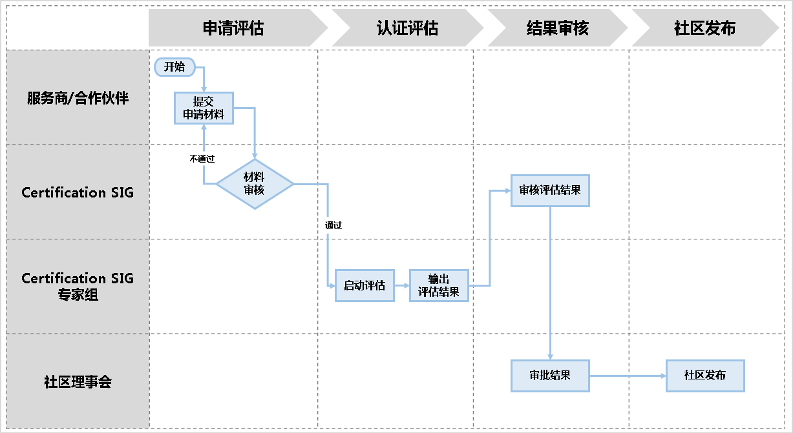

# service-partner-certification
## 介绍
存放openGauss服务商能力评估相关的文档，包括评估标准、流程、指导性文档等。
## 概述
为促进openGauss社区服务体系良性发展和生态繁荣，保证客户的项目交付质量及满意度，加强核心伙伴与openGauss社区的合作，特制定openGauss社区服务商能力评估计划。通过openGauss社区服务商能力评估的服务商可作为社区推荐的优质服务伙伴。
## 评估流程
伙伴/服务商申请openGauss社区服务商能力评估的流程如下图所示：

- 步骤1：伙伴/服务商通过访问[openGauss社区](https://opengauss.org/zh), 进行社区相关账号注册及签署CLA。
- 步骤2：签署完协议后，进入个人中心完善企业信息，包括企业营业执照，企业邮箱等等，提交后系统会自动进行审核，通过审核后才可进行服务商能力评估申请。
- 步骤3：完成协议签署和企业资质审核后，伙伴/服务商即可提交服务商能力评估申请，申请时需提交的信息包含下面《服务商能力评估内容》表格中所有内容对应的材料。
- 步骤4：通过审核后，如果提交的材料存在问题，SIG组成员联系伙伴/服务商进行补充或者澄清。审核完成后SIG组会组织专家启动评估并输出评估报告和结果。
- 步骤5：输出报告后，由Certification SIG组织SIG例会进行报告和结果的评审。
- 步骤6：通过评审后，即进入证书发放流程，此阶段openGauss社区会先对证书信息进行初审，通过后由伙伴对证书信息进行二次确认。
- 步骤7：如社区和伙伴双方都对证书信息确认无误，社区进行证书的签发，并自动同步刷新到社区服务商清单，完成整个流程。
说明：详细的评估指引请见openGauss社区申请入口。
## 服务商能力评估内容
<table>
<thead>
<tr>
<th colspan="3">服务内容</th>
</tr>
</thead>
<tbody>
<tr>
<td><b>考察项</b></td>
<td><b>技术评估项</b></td>
<td><b>评估细则</b></td>
</tr>
<tr>
<td><b>数据库运维服务</b></td>
<td>支持多种形式和定制化数据库服务</td>
<td><b>请举证如下运维服务的对外业务介绍和服务销售文档，例如：</b> (1)驻场服务 (2)快速远程技术支持 (3)数据库深度巡检 (4)数据库版本/补丁升级 (5)现场紧急恢复服务 (6)重大节假日保障 (7)数据库部署实施 (8)数据库备份恢复演练 或者其他运维相关服务内容</td>
</tr>
<tr>
<td><b>数据库迁移服务</b></td>
<td>支持数据库迁移服务</td>
<td><b>请举证如下优化服务的对外业务介绍和服务销售文档，例如：</b> (1)第三方数据库迁移到openGauss (2)离线/在线/增量数据库迁移或同步服务方案</td>
</tr>
<tr>
<td><b>数据库优化服务</b></td>
<td>支持数据库运行优化服务</td>
<td><b>请举证如下优化服务的对外业务介绍和服务销售文档，例如：</b> (1)SQL性能优化 (2)IO性能优化 (3)数据库性能优化 (4)应用性能优化 (5) 端到端系统架构优化 或者其他优化相关服务内容</td>
</tr>
<tr>
<td><b>openGauss培训服务</b></td>
<td>开源内核openGauss构建的数据库软件培训课程</td>
<td><b>请举证如下openGauss培训服务介绍和销售文档，例如：</b> (1)数据库基础课程，包含基本原理、安装部署、日志管理等 (2)数据库进阶课程，包含例行监控、健康检查、备份恢复等 (3)数据库高阶课程，包含故障诊断、效率优化、安全管理等 (4)数据库认证培训类课程 (5)数据库高级开发类课程 提供的其他培训服务相关内容</td>
</tr>
<tr>
<td><b>开源版本更新*</b>(加分项)</td>
<td>匹配openGauss社区开源版本的更新节奏，提供用户使用版本的长期维护能力</td>
<td><b>请举证基于社区LTS开源版本开发的openGauss商用版本/补丁软件和开发说明文档</b></td>
</tr>
<tr>
<td><b>软件BUG修复*</b>(加分项)</td>
<td>针对openGauss社区开源版本的可能的代码BUG，开发特定补丁修复代码问题</td>
<td><b>请举证在openGauss社区已发布的BUG修复技术文档，以及修复方案或共享代码是否被社区合入等相关文档</b></td>
</tr>
<tr>
<td><b>服务区域</b></td>
<td>提供数据库服务业务的区域</td>
<td><b>请举证能够提供服务的区域和相应服务能力证明，例如：</b> (1)具有国内一线城市服务能力, 人员24小时能到现场 (2)具有国内重点区域（省会、二线城市等）服务能力，人员48小时能到现场 (3)具有覆盖全国所有地级市或300+城市以上的服务能力 (4)具有海外3+重点城市服务能力</td>
</tr>
</tbody>
</table>
<table>
<thead>
<tr>
<th colspan="3">服务体系</th>
</tr>
</thead>
<tbody>
<tr>
<td><b>考察项</b></td>
<td><b>技术评估项</b></td>
<td><b>评估细则</b></td>
</tr>
<tr>
<td><b>服务团队</b></td>
<td>专职数据库运维服务团队组织架构及业务目标</td>
<td><b>请举证服务团队组织架构及业务目标，例如：</b> (1)数据库服务团队介绍 (2)对外清晰的服务业务宣传和拓展 (3)正式发布的组织架构和人事任命 (4)例行团队业务运作及日常管理 (5)明确的业务目标和例行绩效考核 (6)发布清晰的管理制度 (7)数据库项目经理人数</td>
</tr>
<tr>
<td rowspan="4"><b>服务专家</b></td>
<td>OGCE/HCIE/其他主流数据库认证</td>
<td rowspan="3"><b>请举证服务团队具有OGCX/HCIX/其他主流数据库认证的人数和证明材料</b></td>
</tr>
<tr>
<td>OGCP/HCIP/其他主流数据库认证</td>
</tr>
<tr>
<td>OGCA/HCIA</td>
</tr>
<tr>
<td>实战经验</td>
<td><b>请举证服务团队专家具有以往成功项目经验和证明材料</b></td>
</tr>
<tr>
<td><b>运维工具</b></td>
<td>openGauss数据库运维工具平台</td>
<td><b>请举证服务相关工具及主要功能演示，例如：</b> (1)具有运维告警监控平台 (2)具有健康检查工具 (3)具有故障信息收集工具 (4)具有性能测试评估工具 (5)具有性能优化工具 (6)具有数据库工具开发规划和团队 (7)远程接入工具平台 (8)智能问答机器人 (9)智能运维工具 (10)数据恢复工具 其他服务工具/平台</td>
</tr>
<tr>
<td><b>运维流程</b></td>
<td>具有的数据库日常运维流程（主动服务，被动响应，显性化两类流程）</td>
<td><b>请举证服务相关流程及相关文档，例如：</b> (1)具有现场运维例行巡检及报告流程 (2)具有现网问题记录、跟踪、处理闭环流程 (3)具有配置变更操作流程 (4)具有版本/补丁升级操作流程 (5)具有重大问题升级流程 (6)具有匹配问题级别的问题响应SLA管理流程 (7)具有其他定义的日常运维操作流程 其他服务相关流程文档</td>
</tr>
<tr>
<td><b>安全规范</b></td>
<td>具有数据库现场和远程运维服务的安全操作规范</td>
<td><b>请举证服务安全管理规范及相关文档，例如：</b> (1)具有运维人员进出场管理规范 (2)具有运维账号管理规范 (3)具有远程接入管理规范 (4)具有高危/高风险操作管理规范 其他安全相关管理规范</td>
</tr>
<tr>
<td><b>服务质量管理</b></td>
<td>对服务的质量和客户满意度监控和管理</td>
<td><b>请举证服务质量管理规范及相关文档，例如：</b> (1)发布客户服务质量管理要求 (2)具有客户服务质量管理例行运作机制 (3)具有客户满意度调查及改进机制 其他服务质量管理规范</td>
</tr>
<tr>
<td><b>现网模拟环境*</b>（加分项）</td>
<td>具备模拟重点客户现网环境的实验设备及数据库环境，满足复杂问题分析定位需求</td>
<td><b>openGauss数据库问题处理环境举证，例如：</b> (1)具有openGauss数据库安装软硬件环境 (2)具有模拟重点客户数据库业务环境 (3)具有数据库相关测试工具和方案 其他实验室环境举证</td>
</tr>
<tr>
<td><b>开发测试环境*</b>（加分项）</td>
<td>具备开发和测试openGauss补丁的验证环境</td>
<td><b>openGauss数据库版本/补丁开发环境举证，例如：</b> (1)具有开发平台和工具 (2)具有开发流程和规范 (3)基于openGauss内核已发布数据库软件版本展示 其他实验室环境举证</td>
</tr>
</tbody>
</table>
<table>
<thead>
<tr>
<th colspan="3">服务承诺</th>
</tr>
</thead>
<tbody>
<tr>
<td><b>考察项</b></td>
<td><b>技术评估项</b></td>
<td><b>评估细则</b></td>
</tr>
<tr>
<td><b>服务响应承诺</b></td>
<td>具有问题受理平台，根据服务SLA承诺处理客户问题</td>
<td><b>请举证服务响应承诺相关的管理规范及业务平台，例如：</b> (1)5*8问题响应平台(2)5*12问题响应平台 (3)7*24问题响应平台 (4)企业邮箱、企业微信等问题反馈平台 (5)公司电话、专家手机等问题反馈平台 (6)400全国统一热线电话等问题反馈平台 (7)问题分级记录、跟踪、按SLA管理平台平台 (8)问题处理案例积累归档，在线智能机器人问答平台 其他问题响应方式</td>
</tr>
<tr>
<td><b>服务响应承诺</b></td>
<td>支持服务语言种类</td>
<td>(1)支持普通话 (2)支持英语 (3)支持其他语言（法语、西班牙语、葡萄牙语等）</td>
</tr>
</tbody>
</table>
<table>
<thead>
<tr>
<th colspan="3">项目经验</th>
</tr>
</thead>
<tbody>
<tr>
<td><b>考察项</b></td>
<td><b>技术评估项</b></td>
<td><b>评估细则</b></td>
</tr>
<tr>
<td><b>项目交付经验</b> (公司成功经验)</td>
<td>主流数据库和重点行业领域运维经验</td>
<td><b>请举证公司已交付的历史成功项目信息，例如：</b> (1)具有不少于三个规模商用数据库(MySQL, Oracle, PostgreSQL等)项目交付 (2)具备不少于三个国计民生重点行业数据库项目交付 (3)具有金融证券行业大型数据库项目交付 其他重点项目交付信息</td>
</tr>
<tr>
<td><b>历史项目规模</b></td>
<td>数据库运维单项目规模</td>
<td><b>请举证公司已交付的历史重大项目服务金额信息及相关材料</b></td>
</tr>
<tr>
<td><b>客户满意度</b></td>
<td>客户满意度</td>
<td>(1)通过公司内部对客户进行满意度调查，有改进计划 (2)通过第三方公司进行满意度调查 ，有改进计划</td>
</tr>
<tr>
<td><b>资质和荣誉</b></td>
<td>具有的数据库领域服务资质和荣誉</td>
<td><b>请举证公司已获得的相关领域资质和荣誉证明，例如：</b> (1)IT行业协会/机构颁发的优质企业认证 (2)和IT行业领导公司建立长期合作伙伴关系 (3)数据库项目用户正式颁发的奖励或表彰 (4)openGauss社区贡献度认可 其他资质或荣誉证明材料</td>
</tr>
</tbody>
</table>
## 复核流程与标准
对于已经通过的服务商，当认证证书一年有效期满的前一个月，需要根据能力评估标准进行复核，具体复核流程与评估流程基本保持一致。

在提交举证材料上，需要明确自认证后的一年中从服务内容、服务体系、服务承诺、项目经验四个维度上新增或者增强的项。
以下项目将做为专家组重点考察项
| 考察加分项 | 技术评估项                                | 评估细则                          |
|-------|--------------------------------------|-------------------------------|
| 服务专家  | oGCX/HCIX及其他主流数据库认证                  | 最近一年新增的认证的人数和证明材料、服务专家学习&培训记录 |
| 专业服务  | 围绕数据库“规建维优营”的专业服务                    | 最近一年新增与增强的专业服务项               |
| 研发能力  | 对openGauss版本提供长期维护能力，不限于BUG修复与版本升级补丁 | 最近一年在社区的BUG修复方案或者技术文档         |
| 运维工具  | 数据库相关的运维工具或平台                        | 最近一年构建的数据库运维工具或平台             |
| 社区贡献  | openGauss社区贡献度认可                     | 最近一年合并请求PR、需求&问题、评审           |
| 交付经验  | 主流数据库和重点行业领域运维经验                     | 最近一年已交付的历史成功项目信息              |

以下为通过复核流程的最低标准
| 考察加分项 | 最低复核通过标准                                                 |
|-------|----------------------------------------------------------|
| 服务专家  | oGCA或HCIA及其它openGauss系的初级认证数不得小于5个，中级认证不得小于3人，高级认证不得小于1人 |
| 专业服务  | 新增专业服务数不得小于1个，对已有专业服务增强不得小于1个                            |
| 研发能力  | BUG修复或者功能开发数不少于3个                                        |
| 运维工具  | 构建或者使用社区工具应用到实际项目不少于3个                                   |
| 社区贡献  | 社区合并请求PR、需求&问题、评审三项总数不得小于3个                              |

## 参与贡献
1. Fork 本仓库
2. 新建 Feat_xxx 分支
3. 提交代码
4. 新建 Pull Request 
